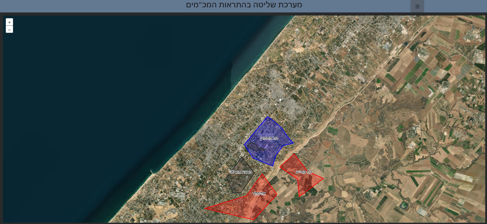
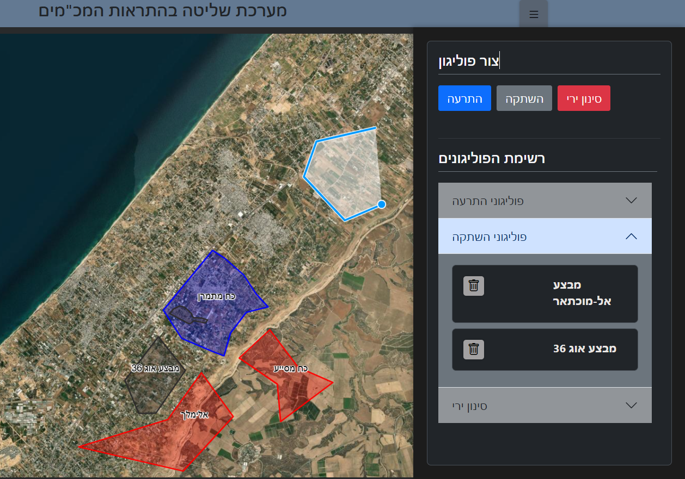

# 🟦🟥🟨 Gaza Polygon Server

שרת וובי לוקאלי להצגת ועיבוד פוליגונים באיזור עזה, ללא תלות ברשת או בשירותים חיצוניים.

⚠️ **המערכת מיועדת לשימוש מבצעי בשטח מנותק רשת** 
– לצורך סימון אזורים רלוונטיים לקבלת התראות על ירי (מרגמות / פצמ"רים) וחיבור עם מערכות מקמ"ש.

## 📦 הפעלה מהירה

בפרויקט יש גם **פרונט** וגם **בקאנד**, יש להריץ את שניהם יחד:

### ✅ הרצת הפרונט:

npm i
npm run dev

✅ הרצת הבקאנד (בטרמינל נוסף):

cd backend
npm i
npm start

🎯 מטרות
הצגת מפה מקומית של עזה עם buffer

ציור פוליגונים בשלוש קטגוריות:

alert_areas – התרעה

muted_launch_areas – השתקה

active_launch_areas – סינון ירי כוחותינו

שמירת הנתונים כקובצי JSON במערכת קבצים מקומית.

האזנה לשינויים חיים ועדכון המפה בהתאם.

🧱 מבנה קובץ ה־JSON

{
  "cooldown_between_alerts_seconds": 30,
  "alert_areas": [ ... ],
  "muted_launch_areas": [ ... ],
  "active_launch_areas": [ ... ],
  "criza_ip": "000.000.00.00"
  }
דוגמה לפוליגון:

{
  "id": "1750542520612",
  "name": "אזור אבטחה צפון",
  "coordinates": [
    [31.5430, 34.4600],
    [31.5500, 34.4700],
    [31.5450, 34.4800],
    [31.5380, 34.4700],
    [31.5430, 34.4600]
  ]
}
🌐 API – נקודות קצה
📥 1. קבלת כל הפוליגונים
URL: GET /api/getPolygons

תיאור: מחזיר את כל הפוליגונים הקיימים לפי סוג.

פלט:

{
  "alert_areas": [ {...}, ... ],
  "muted_launch_areas": [ {...} ],
  "active_launch_areas": [ {...}, ... ]
}
➕ 2. הוספת פוליגון
URL: POST /api/addPolygon/:type

:type: alert_areas, muted_launch_areas, או active_launch_areas

גוף הבקשה:

{
  "id": 1718828573347,
  "name": "פוליגון חדש",
  "status": "התרעה",
  "coordinates": [...],
  "date": "2025-06-18"
}
תגובה:

{ "success": true, "message": "הפוליגון נשמר בהצלחה" }
🗑️ 3. מחיקת פוליגון
URL: DELETE /api/deletePolygon/:id

דוגמה: DELETE /api/deletePolygon/1718828573347

תגובה:

{ "success": true, "message": "הפוליגון נמחק בהצלחה" }
✏️ 4. עריכת פוליגון
URL: PUT /api/editPolygon/:type/:id

גוף הבקשה:

{
  "name": "שם חדש",
  "coordinates": [...],
  "status": "סינון",
  "date": "2025-06-18"
}
תגובה:

{ "success": true, "message": "הפוליגון עודכן בהצלחה" }
🗂️ מבנה תיקיות

📁 Gaza-Polygon-Server/
├── frontend/         ← React app
            
├── backend/          ← Node.js API

               

🔐 אבטחת מידע
⚠️ המערכת פועלת במצב Offline, ללא שליחת מידע לרשת. כל המידע נשמר מקומית בלבד.
בנוסף זה מחשב שיש בו רק רשת צבאית 

🛠 טכנולוגיות
javaScript + React + openLyer 

Node.js + Express

JSON File Storage

👨‍💻 מפתח
אלימלך שיינברגר – 2025
